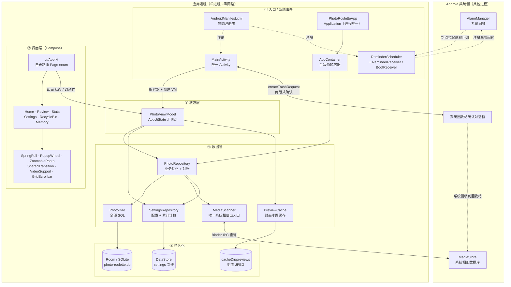
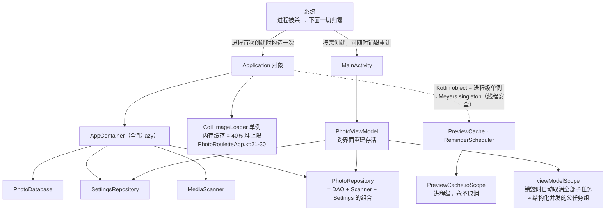
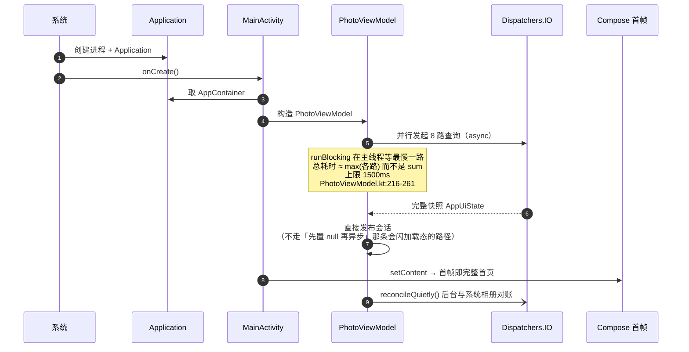
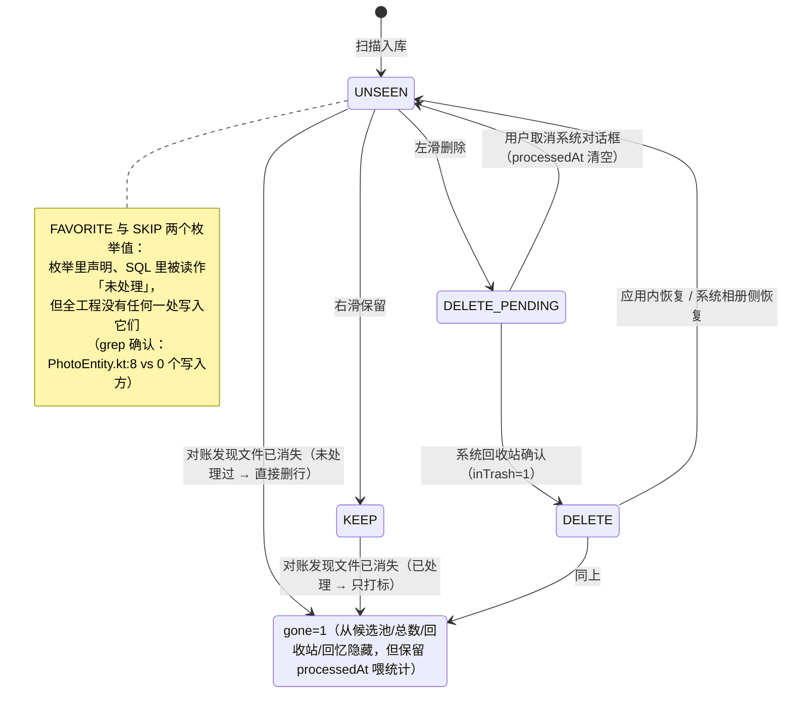
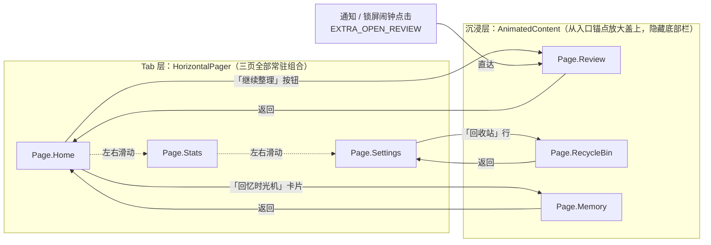
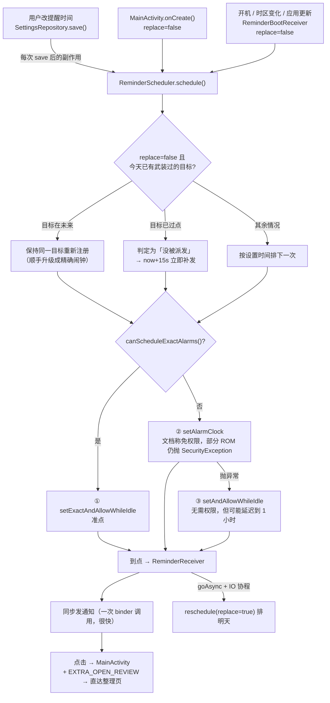
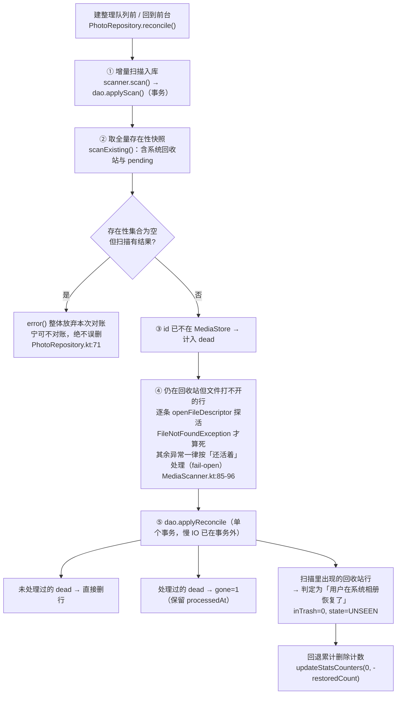
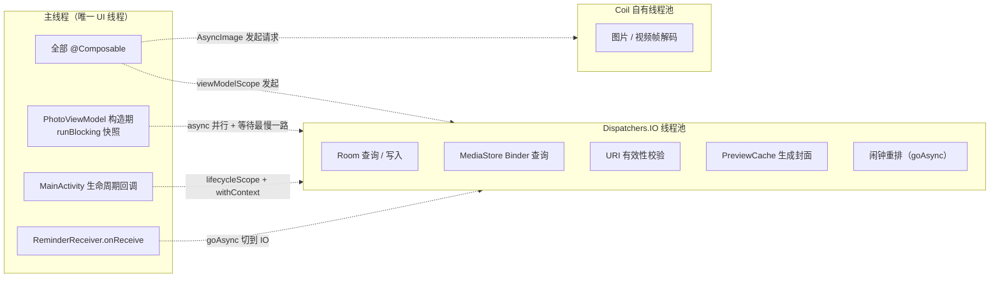

# PhotoRoulette 架构导读 + 代码评审（面向 C++ 工程师）

> 这份文档假设你**只有 C++/桌面开发经验、完全没写过 Android**。所以它做两件旧评审 `architecture-review.md`（写给 Android 老手看）不做的事：
> 1. 用 C++ 里的对应物解释每一个 Android 概念，让你能凭已有直觉读懂结构；
> 2. 用图而不是文字描述结构 —— 图是给不熟悉这套框架的人看的最省力形式。
>
> 事实来源：全仓库通读（主源码约 8000 行 Kotlin + 构建脚本 + Manifest + 迁移测试），所有结论附 `文件:行号`。凡是静态分析无法确定的，都标注了「推测」。

**路径简写约定**（下文一律用简写，避免每行都写全路径）：

| 简写 | 实际位置 |
|---|---|
| `data/` `media/` `ui/` `worker/` `model/` | `app/src/main/java/com/einsli/photoroulette/<同名目录>/` |
| 根目录文件（`PhotoViewModel.kt` 等） | `app/src/main/java/com/einsli/photoroulette/` |

---

## 0. 先读这一段：把它想象成一个 C++ 程序

如果非要用一句话概括这个 App 的运行形态：

> **一个单进程、单 UI 线程、没有析构函数、通过 IPC 访问系统相册数据库的 C++ 程序。**

三句话概括它的架构：

1. **单窗口桌面工具**：主界面是"每日任务卡片 + 统计 + 设置"三个 Tab，另加三个全屏页（整理 / 回收站 / 回忆）。
2. **数据流是单向的**：系统相册 → 本地 SQLite 缓存表 → 状态汇聚对象 → 界面。反向只有"左滑删除"这一条写路径，而且最终删文件是交给**系统**的回收站对话框完成的，App 不直接删。
3. **核心业务逻辑是"抽一批照片让人做二元决策"**：随机/最旧/最大三种策略抽 N 张 → 左滑进回收站、右滑保留 → 用 SQLite 记录决策历史 → 统计页/回忆页回看历史。

### 三个最容易让 C++ 人踩空的地方

| 坑 | C++ 里的情况 | Android 里的情况 |
|---|---|---|
| **没有析构函数** | 栈对象离开作用域自动释放；`unique_ptr` 管住资源 | GC 只管内存，**不保证及时释放**。`Bitmap`、`Cursor`、`VideoView`、监听器都要显式释放。本项目用 Kotlin 的 `use {}`（≈ RAII scope guard）关游标、用 `DisposableEffect` 停播放器 |
| **主线程会 ANR** | 主线程卡住 = 界面卡住 | 主线程卡住超过约 5 秒 = **被系统杀掉**。而且每次 `ContentResolver.query` 是一次跨进程调用，比本地 SQL 贵几个数量级，循环 N 次就卡死。`MainActivity.kt:123` 就是为了这个才把逐条 URI 校验移进 IO 线程池 |
| **对象生命周期 ≠ 作用域** | 对象活到离开作用域 | Activity 会被系统**随时销毁重建**（旋转屏幕、内存紧张）。所以状态不能放成员变量：要么进 ViewModel（跨界面重建存活），要么进 Room/DataStore（跨进程存活），要么 `rememberSaveable`（跨重建的界面局部状态）。本项目 `ui/App.kt:159` 的路由变量就是这么处理的 |

---

## 1. C++ ↔ Android 概念对照表

读代码时对着这张表查。

| Android / Kotlin | C++ 世界的对应物 | 关键差别（为什么会踩坑） |
|---|---|---|
| APK / 应用 | 编译链接后的可执行体 | 没有入口 `main()`；系统按需创建进程并只实例化"被请求的那个组件" |
| ART / 运行时 | OS 进程 + 运行时库 | 内存靠 GC，**无 RAII 释放保证** |
| 进程 | 进程 | 一个 App 通常一个进程；**进程可被杀，内存状态全丢** |
| `Application` 子类 | 进程级全局单例 / 静态初始化 | 进程创建时构造一次。本项目的 `PhotoRouletteApp` + `AppContainer` 就是它（`AppContainer.kt:19`） |
| `Activity` | 一个窗口 + 它的消息循环 | 不是 `main()`，会被反复销毁重建 → 见上面第 3 个坑 |
| `@Composable` 函数 | immediate-mode GUI 的绘制函数（≈ Dear ImGui） | **会被反复调用**，函数体必须幂等；`remember{}` ≈ 跨帧保留的局部变量 |
| 重组 recomposition | 重跑绘制函数 | **从哪里读到状态，哪里就是脏区**。"状态放太上层"会让整棵子树重跑 —— 本项目 `VideoSupport.kt` 的问题就出在这 |
| `ViewModel` | 与界面解耦、跨重建存活的状态机对象 | 比 Activity 活得久；`viewModelScope` 随它销毁而自动取消内部全部任务 |
| 协程 / `suspend fun` | C++20 协程 / 有栈协程 | 编译器把 suspend 函数改写成状态机（CPS 变换）；**挂起不占线程** |
| `Dispatchers.IO` | 线程池 | 磁盘/数据库/IPC 都该切到这里 |
| `Flow` | 响应式流 ≈ 信号槽 + lazy generator | **冷流每次订阅都重新执行一遍**；只有 `StateFlow` 才持有"当前值" |
| `combine(a, b, c)` | 多路信号汇聚成一个槽 | 本项目 `PhotoViewModel.kt:264-270` 把 6 路数据汇成一个 UI 状态对象 |
| Room | SQLite 的类型安全封装 + **编译期代码生成** | `@Dao` 接口的实现由 KSP 生成（≈ `protoc` 生成 `.pb.cc`）。SQL 写在注解字符串里 |
| KSP | 编译期代码生成（protoc / Qt moc） | 本项目用它替代了旧的 kapt（`app/build.gradle.kts:6`） |
| DataStore | 持久化 KV ≈ 一个受保护的配置文件 | 每次 `edit` **整文件重写**；读出来的是 Flow |
| `Cursor` | 迭代器 | 必须 `close()`；写错了就是泄漏 |
| `ContentResolver` / MediaStore | 通过 IPC 访问的**系统数据库** | 每次 `query` 是一次 Binder IPC（≈ D-Bus 调用），代价远高于本地 SQL |
| Binder | IPC 机制 | ≈ D-Bus / COM；`MediaStore` 就是系统相册的 provider |
| `Intent` | 松耦合的"请求/消息" | ≈ `QMetaObject::invokeMethod` 或命令行；也是组件间跳转的方式 |
| `BroadcastReceiver` | 系统事件回调（≈ udev / signal handler） | **进程没起来，系统会先把进程拉起来**再回调。本项目的开机恢复闹钟就靠它 |
| `AlarmManager` | 定时器（`setitimer`） | 但受省电策略管辖、可能需要专门的"精确闹钟"权限 → 本项目做了三级降级 |
| 运行时权限 | capabilities / 沙箱 ACL | 运行时申请、可被拒、可被用户事后撤销 |
| `AndroidManifest.xml` | 静态注册表（≈ systemd unit + capabilities 声明） | 声明有哪些入口组件、要哪些权限。**不在这里声明就收不到系统事件** |
| Gradle / AGP | CMake + 包管理器（vcpkg/conan） | `app/build.gradle.kts` 相当于 `CMakeLists.txt` + 依赖清单 |
| R8 / ProGuard | LTO + 死代码消除 + 符号剥离 | 本项目没写额外规则（`app/proguard-rules.pro` 只有一行注释） |
| `minSdk` / `targetSdk` | 最低支持平台版本 | 本项目 `minSdk = 36`，**只支持 Android 16**（`app/build.gradle.kts:15`） |
| `largeHeap=true` | 申请更大的堆预算 | 和 Coil 的 40% 内存缓存是组合拳（`AndroidManifest.xml:7`） |

---

## 2. 架构图

### 2.1 静态分层与依赖方向

依赖是**严格单向**的：`ui → ViewModel → data/media`，没有反向依赖，没有循环。



**读图要点**

- `MediaScanner` 是**唯一**碰系统相册的地方（`media/MediaScanner.kt`，140 行）；其余代码只跟 SQLite 打交道。这是本架构最值钱的一条边界。
- `PhotoViewModel` 是**唯一的汇聚点**：6 路数据流 combine 成一个 `AppUiState` 对象（`PhotoViewModel.kt:264-270`）。界面层只认这一个对象，不认数据库。
- `AppContainer` 就是 C++ 里的 Service Locator / 全局注册表，解决"谁持有单例"的问题（`AppContainer.kt:19-25`，25 行）。

### 2.2 对象所有权与生命周期（C++ 读者最需要这张图）



**注意两件事**

1. `PhotoRepository` 不是数据的所有者，它只是把 DAO + 扫描器 + 设置拼在一起的**门面（facade）**。真正的数据在 SQLite 和 DataStore 文件里。
2. `PreviewCache` 的 `ioScope`（`media/PreviewCache.kt:50`）是**进程级且永不取消**的——它相当于一个不管生命周期、永远在跑的后台线程池。对一个只写 `cacheDir` 的工具是可接受的，但这是 C++ 里"全局线程池没 join"的味道。

### 2.3 主数据流：一次"左滑删除"到底发生了什么

这是全 App 最复杂的一条链路，跨 6 个对象、2 个进程边界的交互。

```mermaid
sequenceDiagram
    autonumber
    participant U as 手指
    participant SW as ui/Review.kt<br/>SwipePhoto
    participant VM as PhotoViewModel
    participant R as PhotoRepository
    participant DB as Room/SQLite
    participant DS as DataStore<br/>配置与计数
    participant A as MainActivity
    participant MS as MediaStore<br/>系统回收站

    U->>SW: 左滑超过 120dp 阈值
    SW->>VM: onAction(mediaId, DELETE_PENDING, dir=-1, 最后真实触摸时刻)
    Note over VM: 三道防幽灵点击闸门<br/>① 无触摸即拒绝 ② ghost-lock 1500ms<br/>③ 连续动作 400ms 冷却<br/>PhotoViewModel.kt:401-435
    VM->>VM: 会话 position 前移<br/>（先改内存，界面立刻响应）
    VM-->>SW: return true
    VM-)R: launch { apply(mediaId, DELETE_PENDING) }
    R-)DB: UPDATE photos SET state, processedAt
    VM-)DS: savePosition（存档队列写 DataStore）
    VM-)DS: updateStatsCounters(删除 +1)

    U->>SW: 滑完最后一张 → 点「完成」
    SW->>A: onDone → onCommitDeletes()
    A->>VM: pendingDeletes()
    VM-->>A: List&lt;PhotoItem&gt;（state = DELETE_PENDING）
    A->>A: withContext(IO) 逐条校验 URI 是否还有效<br/>MainActivity.kt:123-129
    A->>MS: createTrashRequest(uris, true)
    MS-->>U: 系统确认对话框（App 不直接删文件）
    U->>MS: 确认
    MS-->>A: resultCode = RESULT_OK
    A->>VM: confirmDeleted(ids)
    VM-)DB: inTrash=1, state=DELETE
    A->>VM: nextSession() → 清存档队列 → 建下一批
```

**为什么这样设计**（`MainActivity.kt:47-67` 的注释写明了）：App 先落地 `DELETE_PENDING` 状态，等系统对话框确认后才提交 `DELETE + inTrash=1`。用户在系统对话框上取消，就走 `revertPendingDeletes`（`PhotoDao.kt:107-108`）把它们退回待整理池。

### 2.4 冷启动为什么第一帧就有内容

这是本项目的性能招牌，也是唯一一处主线程同步阻塞 IO。



注释（`PhotoViewModel.kt:211-215`）记录了动机：串行版首帧要 750~1065ms，并行后 ≈ 最慢一路。快照失败或超时则整体退回异步加载路径。

### 2.5 照片状态机（含对账产生的隐藏态）



`gone` 这个软标记是关键设计（`data/PhotoEntity.kt:30-32`）：照片在系统里被外部删掉时，**不删行**，只把 `gone` 置 1。这样它从候选池、总数、回收站、回忆里消失，但 `processedAt` 还在，周统计和"连续整理天数"不会被追溯改写。

### 2.6 页面路由（自己写的，没用 Google 的导航库）



唯一的"路由状态"是一个 `Page` 枚举（`ui/App.kt:132`），用 `rememberSaveable` 保存（`ui/App.kt:159`）—— 所以**旋转屏幕/被系统杀掉后重建，还停在同一页**。枚举代替了原来的魔法整数，`when` 分支漏写会直接编译失败。

### 2.7 每日提醒链路（AlarmManager 三级降级）



为什么不用 WorkManager（Google 的后台任务库）？`worker/ReminderScheduler.kt:22-41` 给了论证：周期任务是非精确的，会被批量延迟；国产 ROM 在应用被划掉或进入 Doze 后基本不会及时执行，结果就是"只有打开 App 时才发通知"。

### 2.8 对账（reconcile）：本地缓存表如何跟上系统相册

App 维护一份 SQLite 缓存表，就必须处理"用户在系统相册里删了照片"这件事。这段逻辑是全项目防御性最强的地方。



第 ④ 步解决的是一个真实存在的 ROM 问题（`media/MediaScanner.kt:78-84` 注释）：HyperOS/MIUI 在系统相册回收站里"永久删除"时**只删文件、残留 provider 行**，纯 id 比对永远判不出（真机实测 `goneMarked` 恒为 0）。

### 2.9 线程模型（哪些代码跑在哪条线程上）



对应表：

| 代码位置 | 线程 | 说明 |
|---|---|---|
| 所有 `@Composable` | 主线程 | 和 Win32 消息循环同一条线程，界面函数必须在这里跑 |
| `PhotoViewModel.kt:216` `runBlocking` | **主线程（阻塞）** | 构造期同步等 IO 快照，内部 8 路 `async` 并行，上限 1500ms |
| `PhotoRepository` 各方法 | 内部 `withContext(Dispatchers.IO)` | 显式包一层，不依赖调用方 |
| `MediaScanner.scan / scanExisting` | 由调用方保证在 IO 上 | 每次 `query` 是一次 Binder IPC |
| `PreviewCache.ensure` | `Dispatchers.IO` | 另有 `ioScope` 做 fire-and-forget 补写 |
| `ReminderScheduler.schedule` | 调用者线程，函数体全是同步系统调用 | 三个调用点分别在 IO / 主线程 / goAsync 协程上 |
| `ReminderReceiver.onReceive` | 主线程（BroadcastReceiver 默认） | 所以通知同步发、重排丢给 `goAsync` |
| Coil 解码 | Coil 自有线程池 | 和你自己的贴图加载线程池同理 |

---

## 3. 文件地图

行数为实测（`read` 工具报告的总行数）。主源码合计 **7936 行**（`.kt`，不含测试），加上 `MigrationTest.kt` 的 81 行约 8000 行 —— 规模上相当于一个中等大小的单模块 C++ 项目，一个人一天能通读一遍。

### 入口与骨架（约 480 行）

| 文件 | 行 | 职责 | C++ 类比 |
|---|---|---|---|
| `AndroidManifest.xml` | 24 | 静态注册表：Activity、2 个 Receiver、5 个权限 | systemd unit + capabilities 声明 |
| `PhotoRouletteApp.kt` | 31 | Application 子类；**Coil 图片加载器的唯一配置点** | 进程级全局单例 + 静态初始化 |
| `AppContainer.kt` | 25 | 手写 DI：db / settings / scanner / repository 四个懒单例 | Service Locator / 全局注册表 |
| `MainActivity.kt` | 185 | 唯一 Activity；权限申请、系统回收站对话框、通知直达 | 主窗口 + 消息循环 + 系统对话框胶水 |
| `worker/ReminderScheduler.kt` | 160 | 闹钟注册（三级降级 + 漏发守卫）+ 发通知 | 定时器 + 降级策略 |
| `worker/ReminderReceiver.kt` | 53 | 两个 BroadcastReceiver：到点提醒分发 / 开机等环境恢复 | 系统事件回调 |

### 数据层与媒体层（约 850 行）— 本项目质量最高的部分

| 文件 | 行 | 职责 |
|---|---|---|
| `data/PhotoEntity.kt` | 33 | 表结构：photos 表 13 列 + 4 个索引 + `PhotoState` 枚举 |
| `data/PhotoDao.kt` | 208 | **全部 SQL 集中于此**（注解字符串里）：候选查询、状态更新、对账写入、统计聚合 |
| `data/PhotoDatabase.kt` | 56 | Room 数据库定义 + 4 条显式迁移（3→4→5→6→7） |
| `data/PhotoRepository.kt` | 128 | 业务动作门面 + 对账算法（本项目最硬的逻辑） |
| `data/SettingsRepository.kt` | 116 | DataStore 配置（10 项）+ 累计计数（与照片表分离） |
| `media/MediaScanner.kt` | 140 | **唯一**碰系统相册的地方：扫描、存在性快照、文件活性探测 |
| `media/PreviewCache.kt` | 131 | 首页封面小图落盘缓存（单飞 + LRU 60 个文件） |
| `model/PhotoItem.kt` | 41 | **UI 专用模型**：切断数据库实体直漏界面 |

### 状态层（571 行）

| 文件 | 行 | 职责 |
|---|---|---|
| `PhotoViewModel.kt` | 571 | 全 App 唯一状态汇聚点：6 路 Flow combine 成 `AppUiState`；会话队列、撤销栈、防幽灵点击、周统计、回忆、冷启动快照、9 个设置转发 setter |

### 界面层（约 3350 行，主要是 Compose 声明式布局）

| 文件 | 行 | 职责 |
|---|---|---|
| `ui/App.kt` | 465 | 路由（`Page` enum）、Tab pager、沉浸页转场、主题接入 |
| `ui/Home.kt` | 499 | 首页：今日任务卡、进度、统计条、回忆时光机卡 |
| `ui/Review.kt` | 405 | 整理页：`SwipePhoto` 卡片左右滑 + 手写缓动动画 |
| `ui/Settings.kt` | 468 | 设置页：6 组设置 + 3 个弹层 + 相册选择器 |
| `ui/MediaGridScreen.kt` | 609 | 回收站/回忆共用的宫格骨架（选择模式 + 预览 overlay 状态机） |
| `ui/StatsScreen.kt` | 746 | 统计页：周趋势图、月历热力图、历史周切换 |
| `ui/RecycleBin.kt` | 106 | 回收站页（`MediaGridScreen` 的薄包装） |
| `ui/MemoryViewer.kt` | 54 | 回忆页（同上） |

### 界面基础设施与组件（约 2700 行）

| 文件 | 行 | 职责 | 是否可脱离业务复用 |
|---|---|---|---|
| `ui/PhotoSharedTransition.kt` | 820 | 宫格↔预览共享元素飞行、缩略图请求、宽高比缓存 | 半（绑 `PhotoItem`） |
| `ui/VideoSupport.kt` | 448 | 视频播放、1s 帧静态图、播放控制条 | 半 |
| `ui/PopupWheel.kt` | 323 | 弹出卡片 + 滚轮选择器 | **是** |
| `ui/ZoomablePhoto.kt` | 290 | 双指缩放/双击放大/下滑关闭 | 半 |
| `ui/SpringPull.kt` | 275 | 弹性回弹 + 自定义 fling 行为（iOS 式橡皮筋） | **是** |
| `ui/GridScrollbar.kt` | 227 | 宫格悬浮滚动条 | **是**（但列数写死 4） |
| `ui/DesignColors.kt` | 131 | 33 个字段的设计色板 | 否（品牌色） |
| `ui/Theme.kt` | 88 | Material3 主题 + 深浅色方案 | 否 |
| `ui/PhotoPreloader.kt` | 85 | 固定窗口缩略图预载（停稳 150ms 后铺可见区 ±30 张） | 半 |
| `ui/Format.kt` | 19 | 容量格式化 | **是** |

### 测试与构建

| 文件 | 行 | 说明 |
|---|---|---|
| `app/src/androidTest/.../MigrationTest.kt` | 81 | v6→v7 迁移测试：验证索引建对、数据没丢 |
| `app/build.gradle.kts` | 65 | 依赖清单 + KSP Room schema 导出（≈ CMakeLists） |
| `app/schemas/.../6.json` `7.json` | — | Room 导出的数据库 schema，进版本控制，供迁移测试校验 |
| `architecture-review.md` | 141 | 旧评审（面向 Android 老手），本文档是它的 C++ 友好版 |

---

## 4. 做得好的地方

按"含金量"排序，都是我在通读中确认为真的。

1. **分层与边界非常干净**。`ui/` 目录里**零处**引用数据库实体 `PhotoEntity`（grep 确认无匹配）—— 靠 `model/PhotoItem.kt` 这一层映射（`PhotoEntity.toItem()`）切断。数据库加一列，只需要改映射那一行，界面代码一行不动。这个纪律很多成熟 Android 项目都做不到。

2. **系统相册交互的防御性设计**（`media/MediaScanner.kt` + `data/PhotoRepository.kt`）。这是全项目最有工程含量的部分：
   - 存在性查询为空就整体放弃对账，宁可不对账也绝不误删（`PhotoRepository.kt:71`）；
   - 用**文件描述符探活**识别 MIUI/HyperOS 的残留 provider 行，且 fail-open：只有 `FileNotFoundException` 才算死，权限抖动等其他异常一律按"还活着"处理（`MediaScanner.kt:85-96`）；
   - `chunked(900)` 绕开 SQLite 的 `IN` 参数上限（`PhotoDao.kt:174-175`）；
   - 删文件交给系统的 `createTrashRequest` 两段式确认，App 永不直接删（`MainActivity.kt:145`）。

3. **事务边界处理正确**。慢 IO 留在事务外、多步连续写在事务内：`PhotoDao.kt:43-58`（`applyScan`）和 `:170-182`（`applyReconcile`）。注解写得很清楚："这里只做纯 DB 写，慢 IO 必须由调用方留在事务外"。这是很多项目做错的地方（把 IPC 扫描塞进事务，长时间持锁）。

4. **迁移安全成体系**：`exportSchema = true`（`PhotoDatabase.kt:10`）+ 显式迁移 + 迁移测试 + **只对 v1/v2 破坏性回退**（`PhotoDatabase.kt:54` `fallbackToDestructiveMigrationFrom(1, 2)`）。而 `MigrationTest.kt` 不只验证索引建对，还验证**行数据没被迁移动过**（`:59-66`）。

5. **并发竞争的"世代计数"护栏**：`buildVersion`（`PhotoViewModel.kt:83`、`:311`、`:327-333`）。异步建队列返回时，如果期间用户已经重建过会话，就把这个过期结果丢弃。这是处理"异步结果回来时世界已经变了"的标准手法，实现正确。

6. **注释文化罕见地好**。每个非平凡 hack 都写了"真机复现 + 根因 + 为什么不能用别的写法"。举三个例子：
   - `ui/App.kt:169-211`：pager 点击动画被手势打断时，`MutatorMutex` 优先级导致的 trampoline 饿死互锁（实测 2 秒 30 万拍、主线程 100%），以及为什么重试之间必须用 `withFrameNanos` 而不是 `snapshotFlow` 等待；
   - `PhotoViewModel.kt:84-107`：MIUI 手写笔服务注入点击的三重过滤闸门（无触摸即拒绝 / ghost-lock / 冷却）；
   - `MainActivity.kt:96-98`：为什么**刻意不**在 `onResume` 里重排闹钟（会和 `onCreate` 的重排竞态，真机已复现）。
   
   失败经验被固化成注释，这对一个只有单人维护的项目来说是最有价值的资产。

7. **性能设计成体系**：固定窗口预载（停稳 150ms 防抖 + 窗口外取消，`ui/PhotoPreloader.kt:26-27`）、缩略图降采样、`graphicsLayer` 弹性拉不走重组、`thumbSnap` 命中免淡入、并行冷启动快照。

8. **`PreviewCache` 的单飞（single-flight）**：`Mutex` + `inflight` 集合（`media/PreviewCache.kt:46-47`、`:71-72`）保证同一张图的并发生成只跑一次 —— 典型的 request coalescing，实现是对的。

---

## 5. 问题清单

分三级。每条都带 `文件:行号`，静态分析无法确定结论的标注「推测」。

### 高（会崩 / 会算错 / 会丢数据）

**H-1　`SpringPull` 的回弹效果与注释矛盾，实际不存在**

`ui/SpringPull.kt:150-153`：

```kotlin
// Bouncy fling kicks: damping 0.4 gives a visible overshoot on the return
// (lower = more oscillation); drag pulls still glide back with no bounce.
dampingRatio = if (bouncy) 3.0f else Spring.DampingRatioNoBouncy,
```

注释说"阻尼 0.4 产生可见过冲"，代码写的是 **3.0**。Compose 里 `1.0f` 就是临界阻尼（常量名 `DampingRatioNoBouncy`），**大于 1 是过阻尼 —— 只会单调回归、绝无过冲**。所以"fling 打到边界后可见回弹"这个设计意图在实现里落空了，两个分支的差别只剩刚度（stiffness）不同。

这是我把注释、代码、框架常量三者对齐后确认的矛盾，不是推测。改法：`0.4f` 或 `Spring.DampingRatioLowBouncy`（0.75f）。

**H-2　`PreviewCache` 回收了可能属于 Coil 内存缓存的 Bitmap**

`media/PreviewCache.kt:75` 取位图，`:83-84` 清理：

```kotlin
val bitmap = loadViaSystemThumbnail(app, photo) ?: loadViaCoil(app, photo) ?: return@withContext
...
if (scaled !== bitmap) bitmap.recycle()
scaled.recycle()
```

`loadViaCoil`（`:103-111`）用 `content://` URI 请求 Coil，**没有设 `memoryCachePolicy`**，所以 Coil 2 默认会把解码结果放进内存缓存；`:110` 从 `BitmapDrawable.bitmap` 拿到的就是缓存里那个对象本身。`recycle()` 会把它标记为已回收，后续同一请求命中该缓存项时就会拿到一张废位图（典型报错 `Canvas: trying to use a recycled bitmap`）。

**推测**（未做真机复现）实际触发路径较窄：`ensure` 有"文件已存在即返回"的短路（`:70`），只有落盘失败后重试才会再次走 `loadViaCoil`；而且 `compress` 抛的 `IllegalStateException` 正好被 `:80` 的 `runCatching` 吞掉，所以表现为"封面静默生成失败"而不是崩溃。但这是**污染了全局共享缓存**，其他消费者（同一请求参数）理论上会拿到废位图。

改法：给 `loadViaCoil` 的请求加 `.memoryCachePolicy(CachePolicy.DISABLED)`，或在回收前先 `copy()`。

**H-3　静默失败面仍然偏大（沿用旧评审未完成项，我复核后仍成立）**

- `MediaScanner.kt:45` `?: emptyList()`：扫描查询返回 `null` 时被当成"相册里一张照片都没有"。**注意同一文件里的另一条路径处理得更严**：`scanExisting()` 在 `:75` 是 `error(...)`，让调用方放弃对账。两条路径对"空结果"的态度不一致。
- `PhotoViewModel.kt:322-324` 与 `:347-349`：对账抛异常只写 `Log.w`，界面零提示。
- `ReminderScheduler.kt:116-119`：闹钟注册失败只写日志（注：**通知权限**被拒的降级提示已在设置页做了，这条是闹钟注册本身的失败）。

后果：用户看到"总数 0 / 统计不涨"，无法区分"真的没有照片"和"出错了"。旧评审把这条标为"仍待产品设计"，我认同 —— 技术侧缺的只是一个错误状态位，难在 UI 怎么表达。

**H-4　`strings.xml` 与 Manifest 漂移，且全工程零 i18n**

- `app/src/main/res/values/strings.xml:3` 定义 `app_name` = **"每日相册"**；
- `AndroidManifest.xml:7` 硬编码 `android:label="照片轮盘"`，**没用那个资源**；
- 全工程 **0 处** `stringResource` / `R.string`（grep 无匹配），所有界面文字都是 Kotlin 文件里的中文字面量（`Home.kt`、`Review.kt`、`Settings.kt`、`StatsScreen.kt` 各有几十处）。

后果：改文案要改代码重新编译；多语言无从下手；`strings.xml` 是个死文件，反而误导读者以为文案集中管理。这是纯工程化层面的硬伤，也是纯静态可验证的事实。

### 中（性能 / 可维护性）

**M-1　视频轮询的"只重组控制条"结论不成立（修正旧评审的低-19）**

旧评审把"低-19 VideoPhoto 每 250ms 轮询触发重组"标为**已修**。控制条确实拆成了独立组件（`ui/VideoSupport.kt:386-448`），拖动也改成松手才 `seekTo` 一次（`:428-432`）—— 这两点属实。

但 `positionMs` 这个状态**仍然声明在父级**（`:197`），被 `:249-255` 的 250ms 轮询更新，而父级函数体在 `:352` 读了它并传给控制条。按 Compose 的快照语义，**读状态的位置就是失效范围**：于是 `VideoPhoto` 自己的作用域每 250ms 失效一次并重跑函数体。拆出子组件只避免了"子组件内部跟着重跑"，并没有避免父作用域重跑。

**:347-348 和 :380-383 的注释声称"轮询只重组控制条自身，不再波及播放器/静态帧/触摸层"，这个说法是错的。** 真要成立，得把 `positionMs` 的状态和那个 `while` 循环都搬进 `VideoControlsBar` 内部（把 `videoView` 和 `isPlaying` 传进去即可）。结论基于框架语义的静态推断，标注「推测未实测」。

**M-2　每次点开预览都会重建整个宫格**

`ui/MediaGridScreen.kt:211-212` 用 `key(previewSession) { PhotoSharedTransitionLayout { ... } }` 包住整棵子树（含 4 列宫格），而 `:285` 每次点格子都 `previewSession++`。也就是**每打开一次预览，宫格里的所有 cell 都离开组合再重建一次**。

注释（`:208-210`）说明了动机：重 key 是为了清空所有共享元素的 `currentBounds`，否则"滚动后再点"的飞机会从旧位置起飞。这是**有意识的权衡**，不是疏忽。但代价明确：如果点击缩略图感觉掉帧，这里是第一嫌疑点。可能的改进方向是只重 key 转场作用域而不是整个宫格，但实现难度不小。

**M-3　月历在弹层关着的时候也在查数据库**

`ui/StatsScreen.kt:541` `LaunchedEffect(calMonth) { calCounts = monthDayCounts(calMonth) }` 不判断 `popup.expanded`（对比 `:538-539` 其他地方都判断了）→ 月历没打开也每次都查一次月统计。而且 `HistoryWeekHeader` 每个 pager 页各一份（`:399`），会重复查。加一个 `if (popup.expanded)` 就够。

**M-4　宫格列数在两处共 5 个地方硬编码**

`ui/GridScrollbar.kt:95`、`:96`、`:132`、`:175` 各写了一次数字 4，`ui/MediaGridScreen.kt:262` 是 `GridCells.Fixed(4)`。**两套独立硬编码同一个"列数"**：将来把宫格改成 3 列或 5 列，滚动条必然算错（而且不会编译报错、不会崩，只会滚歪）。应该提成一个常量或参数传进去。

**M-5　死代码与死 schema 面（会让读者误判"这里有功能"）**

grep 逐一确认：

- `PhotoState.SKIP` 和 `PhotoState.FAVORITE`（`data/PhotoEntity.kt:8`）**全工程没有任何写入方** —— 只在 SQL 谓词里被读作"未处理"。连带 `PhotoRepository.kt:118` 的 `if (state == PhotoState.SKIP) null` 分支不可达。
- `lastShownDay` 列（`PhotoEntity.kt:27`）+ `markShown()` DAO 方法（`PhotoDao.kt:73-74`）**无任何调用方**。
- `ui/VideoSupport.kt:388` 的 `videoView` 参数在 `:351` 传入，但 `:386-448` 的函数体从未读过它（**推测**：作者本意是用它做 seek，后来改用 `onSeek` 回调，参数忘了删）。
- `ui/Theme.kt:81` 的 `dynamicColor` 参数是文档化的 no-op（`:74-78` 自己承认）。
- `ui/Home.kt:22` 未使用的 import。
- `ui/MemoryViewer.kt:38` 的 `headerContent` lambda 收了 `enterSelection` 参数却没用（**推测**：对比 `RecycleBin.kt:62/71` 是用了的）。

**M-6　可验证的复制粘贴**

| 重复内容 | 位置 |
|---|---|
| 品牌色板写两遍 | `ui/Theme.kt:9-71` ≡ `ui/DesignColors.kt:56-127` |
| 占位图淡入 `tween(180)` 五份 | `ZoomablePhoto.kt:176`、`:198`；`PhotoSharedTransition.kt:252`；`VideoSupport.kt:291`、`:308` |
| Crop↔Fit 换算 | `ZoomablePhoto.kt:128-130` ≡ `VideoSupport.kt:209-211` ≡ `PhotoSharedTransition.kt:226-227` |
| 首页与统计页的算式 + 卡片 | `Home.kt:271-273`、`:327`、`:337-357` ≡ `StatsScreen.kt:100-103`、`:302-322` |
| 日期格式化 guard + `SimpleDateFormat` | `Review.kt:141-142` ≡ `RecycleBin.kt:101-103` |
| 手写缓动循环三份 | `Review.kt:253-264`、`:269-279`、`:283-293`（注意 `Review.kt:6` 已经 import 了 `Animatable`，却没用来替代手写循环） |
| 容量格式化 | `Format.kt:9` 与 `App.kt` 内的私有 `formatBytes`（`Format.kt:6-7` 的注释**自己承认**了这个重复） |
| 权限提示行 | `Settings.kt:121-135` ≡ `:143-159` |

**M-7　SQL / 查询层细节**

- **SQL 双份维护**：`PhotoDao.kt:90`（Flow 版）与 `:94`（一次性版）两条完全相同的查询；`:122` 与 `:126` 同理。注释已明确标注"改一处必须两处同步"—— 但同步靠人，没有任何机制保障。
- **候选查询的 WHERE 写三遍**：`PhotoDao.kt:61`、`:64`、`:67` 三个策略（random/oldest/largest）各写一遍完整谓词。加一个过滤条件要改三处。
- `data/PhotoRepository.kt:97` `sortedBy { savedIds.indexOf(it.mediaId) }` 是 O(n²)。队列默认 10 张、上限名义上 100 张，无实际影响，但写法上是个 O(n²) 陷阱。
- `media/PreviewCache.kt:124-130` 的 `prune` **每生成一张封面就全目录 `listFiles()` + 排序**，O(n log n)/张。`KEEP_FILES = 60` 规模小，可接受，但没有节流。

**M-8　`PhotoViewModel` 的职责边界**

571 行、21 个公开方法，同时负责：会话队列、撤销栈、防幽灵点击、周统计窗口、回忆挑选、冷启动快照、9 个纯转发的设置 setter（`:487-501`）。设置 setter 那一组尤其稀释信号 —— 它们只是把参数塞给 `SettingsRepository.save()`。

另外 `:216` 的 `runBlocking` 是**主线程同步等 IO**（虽然是并行化的、有 1500ms 上限）。设计意图明确且注释充分（首帧不许有加载态），但低端机 DataStore 首次读盘 + Room 开库有可能逼近上限。建议保留设计但把超时降到 400~600ms 并采样记录实际耗时分布。

### 低（细节）

| # | 问题 | 位置 |
|---|---|---|
| L-1 | `String.format` 未指定 Locale（同项目 `VideoSupport.kt:70` 用了 `Locale.US`，两种约定并存） | `ui/Format.kt:14-16` |
| L-2 | `currentMonday` 里 `LocalDate.now()` 被调两次（`:175` 与 `:176`），跨零点理论上会不一致 | `PhotoViewModel.kt:173-180` |
| L-3 | `values.lastIndex` 参与 `coerceIn`，`values` 为空时抛异常（取决于调用方） | `ui/PopupWheel.kt:270` |
| L-4 | `rememberSnapFlingBehavior(...)` 没包 `remember`，每次重组都新建 | `ui/PopupWheel.kt:290` |
| L-5 | 双击放大动画未取消上一次 → 快速双击可能叠两段动画 | `ui/ZoomablePhoto.kt:108-114` |
| L-6 | 用 `background.luminance() < 0.5f` 判深浅色，忽略了已经算好的 `isDark` | `ui/DesignColors.kt:131` |
| L-7 | `40%` 堆内存缓存 + `largeHeap=true` 是组合拳：撑得住大缓存，但 OOM 时更早被系统杀 | `PhotoRouletteApp.kt:27`、`AndroidManifest.xml:7` |
| L-8 | `minSdk = 36`（只支持 Android 16）对工具类 App 是极窄的覆盖面（**推测**是有意为之） | `app/build.gradle.kts:15` |
| L-9 | 选择模式下每次勾选都新建一个 `Set`（O(n) 拷贝），且被每个 cell 通过 `contains` 读 → 所有可见 cell 重组 | `ui/MediaGridScreen.kt:274`、`:294` |
| L-10 | `formatTaken` 每次调用新建一个 `SimpleDateFormat` | `ui/Review.kt:141-142` |

---

## 6. 与旧评审 `architecture-review.md` 的差异（我复核后的修正）

已经修好的部分我抽查确认属实，逐条列出来避免你重复劳动：

| 旧评审结论 | 我的复核 |
|---|---|
| 高-2「主线程 IO 已修」 | ✅ 成立。`MainActivity.kt:123`、`:161` 确实在 `withContext(Dispatchers.IO)` 里 |
| 高-3「迁移即清库已修」 | ✅ 成立。`PhotoDatabase.kt:10` `exportSchema = true`；`:54` 只对 v1/v2 破坏性回退；`MigrationTest.kt` 校验索引 + 数据保留 |
| 高-1「Coil 加载器冲突已修」 | ✅ 成立。`MainActivity.kt:71-73` 的注释明确禁止再调 `Coil.setImageLoader`，唯一配置点在 `PhotoRouletteApp.kt` |
| 中-5「拆分 App.kt + MediaGridScreen 去重」 | ✅ 成立。`ui/App.kt` 实际 465 行；`RecycleBin.kt` 106 行、`MemoryViewer.kt` 54 行，都是 `MediaGridScreen`（609 行）的薄包装 |
| 中-6「切断 Entity 直漏」 | ✅ 成立且彻底。`ui/` 目录 grep `PhotoEntity` 零匹配 |
| 中-9「FAVORITE 不可达」 | ✅ 成立，并且**不止 FAVORITE**：`SKIP` 同样无写入方，另有 `lastShownDay` + `markShown()` 整条链路无调用方（见 M-5） |
| 低-19「视频轮询优化已修」 | ⚠️ **结论过强**。控制条拆分与松手才 seek 属实，但轮询状态仍在父级，父作用域照样每 250ms 重跑（见 M-1） |
| 低-13「`PhotoAspectCache` 无界 HashMap」 | ✅ 已修成 `LruCache(512)`（`ui/PhotoSharedTransition.kt:93-94`） |
| 高-4「静默失败 UI 信号」 | ⚠️ 通知权限那条确实做了；扫描失败与对账失败两条仍未做（见 H-3） |

**本文档新增、旧评审未覆盖的问题**：H-1（回弹阻尼注释矛盾）、H-2（Cache 回收 Coil 位图）、H-4（零 i18n + strings.xml 漂移）、M-1（轮询重组范围）、M-3（月历空转查询）、M-4（列数五处硬编码）、M-6 中新增的几项重复、M-5 中 `SKIP`/`lastShownDay`/`markShown` 这三处死代码。

---

## 7. 如果你要动手改代码

### 建议的阅读顺序（约 2 小时能读完主干）

1. `README.md`（52 行）—— 知道这程序干什么。
2. 本文档 §2.1 和 §2.2 两张图 —— 建立整体骨架。
3. `data/PhotoEntity.kt`（33 行）—— **先看数据结构**，C++ 人的本能，这里也是最省力的入口。
4. `data/PhotoDao.kt`（208 行）—— 全部 SQL 都在注解里，等于一份完整的数据访问清单。
5. `data/PhotoRepository.kt`（128 行）—— 业务动作 + 对账算法。**这是全项目逻辑密度最高、最值得精读的文件**。
6. `media/MediaScanner.kt`（140 行）—— 唯一碰系统相册的地方。
7. `PhotoViewModel.kt`（571 行）—— 状态怎么汇聚、异步怎么防竞态。
8. `ui/App.kt`（465 行）—— 路由与页面转场总入口。
9. `ui/Home.kt` → `ui/Review.kt` → `ui/MediaGridScreen.kt` —— 三条主要界面。
10. `worker/ReminderScheduler.kt`（160 行）—— 后台调度与降级。

**第一遍可以跳过**：`ui/PhotoSharedTransition.kt`（820 行动画细节）、`ui/StatsScreen.kt`（746 行图表绘制）、`ui/PopupWheel.kt`。这三个是"实现精细但不影响理解架构"的类型。

### 改代码时的注意事项

- **改数据库列**：只需改 `PhotoEntity.kt` + `PhotoItem.kt` 的映射 + 加一条 `Migration` + 重建一次让 Room 重新导出 schema 到 `app/schemas/`。**不要**改 `ui/` 里的任何文件 —— 如果你发现必须改，说明边界被破坏了。
- **改 SQL**：注意 `PhotoDao.kt:90/94` 和 `:122/126` 这两组是双份维护，改一处必须改另一处。三个候选查询的谓词（`:61/64/67`）也是三份。
- **加界面文案**：目前没有 i18n 基础设施，只能加中文字面量（或顺便按 H-4 把 `strings.xml` 基础设施建起来）。
- **动宫格列数**：记住 `GridScrollbar.kt` 里有四处独立的数字 4（M-4）。
- **看到 `Log.d`/`Log.w` 的地方**：这个项目把日志当"诊断资产"在用（很多注释指向日志输出）。改动时不要把日志删掉，它们是这些 ROM 适配经验的唯一运行时证据。
- **`ui/App.kt:169-211` 那段 pager 收敛循环**：读注释再动，注释里记录了一个"主线程 100% 饿死互锁"的真机故障，改错方向会复活它。

---

## 8. 术语表（按在本文档中出现的顺序）

| 术语 | 说明 |
|---|---|
| **Compose** | Android 的声明式 UI 框架。函数标注 `@Composable`，由框架反复调用，≈ immediate-mode GUI |
| **重组 recomposition** | 状态变化后框架重新调用受影响的 `@Composable` 函数。**读状态的位置决定重跑范围** |
| **`remember` / `rememberSaveable`** | 跨重组保留的局部状态 / 还能跨"系统销毁重建"保留 |
| **Room** | SQLite 的 ORM，编译期生成实现代码。`@Entity` 是表，`@Dao` 是访问接口，`@Query` 里写 SQL |
| **DataStore** | 官方持久化 KV，替代老的 SharedPreferences。读出来是 Flow，写是整文件重写 |
| **Flow / StateFlow** | 响应式数据流。冷流每次订阅重新执行；`StateFlow` 持有当前值 |
| **ViewModel** | 与界面解耦、跨界面重建存活的状态对象。`viewModelScope` 随它销毁而取消所有子任务 |
| **协程 / `suspend`** | Kotlin 的异步机制，编译器把 suspend 函数改写成状态机；挂起不占线程 |
| **Dispatcher** | 协程运行在哪个线程池上。`Dispatchers.IO` = 阻塞 IO 用的线程池 |
| **Coil** | 图片加载库，自带内存 + 磁盘缓存和视频抽帧解码器 |
| **MediaStore** | 系统相册数据库，通过 Binder IPC 访问 |
| **Binder** | Android 的 IPC 机制，≈ D-Bus / COM |
| **`createTrashRequest`** | 请求系统弹出回收站确认对话框的 API。App 不直接删文件 |
| **AlarmManager** | 系统闹钟，第三方 App 可注册的单次/周期定时器 |
| **Doze / 省电策略** | 系统在待机时限制后台任务和网络的机制，是国产 ROM 提醒不准时的根因 |
| **ANR** | Application Not Responding：主线程阻塞过久被系统判定无响应并杀掉 |
| **KSP** | Kotlin 符号处理，编译期代码生成（Room 用它生成 DAO 实现），≈ protoc |
| **`goAsync()`** | BroadcastReceiver 里延长回调生命周期的机制，让异步工作能在 `onReceive` 返回后继续 |

---

## 一句话总结

**把它当成一个单进程、单 UI 线程、没有析构函数、靠 IPC 读系统相册的 C++ 程序来看：分层与事务边界干净且专业，数据层（尤其对系统相册的防御性适配）和注释质量明显高于同类项目，`ui/` 与数据库实体之间的边界纪律执行得很彻底。**

**欠债集中在三处**：(1) 几个巨型 Composable（`MediaGridScreen` 415 行的单函数、`SwipePhoto` 262 行、`Settings` 243 行）与它们之间的复制粘贴；(2) 工程化基础设施缺位（零 i18n、无 lint 约束、`strings.xml` 是死文件）；(3) **注释声称的行为与代码实际行为不一致** —— `SpringPull` 的回弹（H-1）和视频轮询的重组范围（M-1）都属于这类，而这类问题最危险，因为它会让读者（包括未来的你自己）相信一个不存在的保证。建议优先修这三处里的具体项，其余低优先级项可以长期放着。
